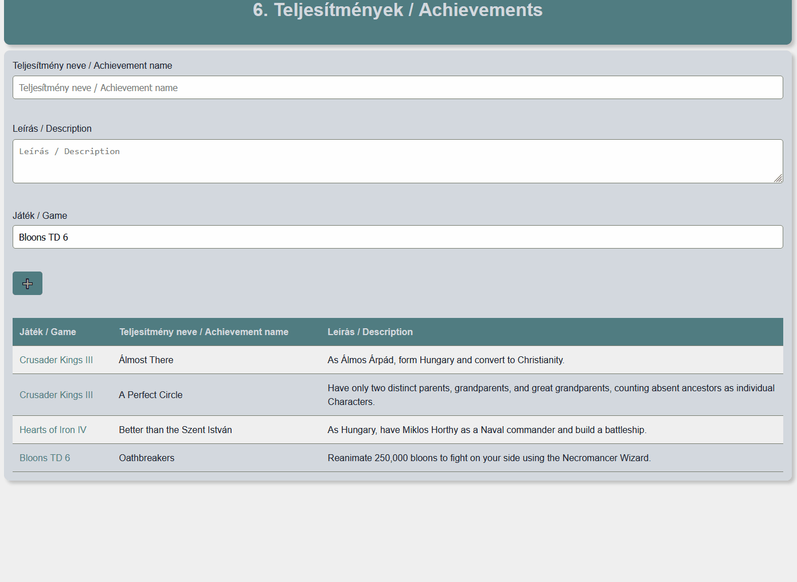

### Teljesítmények (php-6-achievements, 12 pont)
A játékokat gyakran különböző elérhető teljesítmények/mérföldkövek színesítik. A platform szeretné, ha a játékokhoz tartozó teljesítményeket meg tudnák jeleníteni a játékok oldalán. **Nem kell ellenőrizned az űrlap helyességét!** Az adatokat el kell tárolnod JSON-ben, és onnan ki kell tudnod olvasni.

- **a)** 1 pont: Az űrlap `select#game` mezőjébe generáld ki a játékokat a `data.json` fájlból. Minden játékhoz tartozzon egy `option` elem, melynek `value` attribútuma a játék `id`-ja, a tartalma pedig a játék `name`-je.
- **b)** 3 pont: Lehessen új teljesítményt hozzáadni az űrlap segítségével.
- **c)** 3 pont: Ha az űrlapba beírt teljesítmény neve már létezik az adott játékra, frissítsd az adott teljesítmény leírását az újonnan megadottra.
- **d)** 2 pont: Az űrlap alá legyenek listázva a már hozzáadott teljesítmények nevei és leírásai.
- **e)** 2 pont: Ha egy teljesítményre kattintunk, kerüljünk a hozzá tartozó játék oldalára, ahol megjelenik címként a játék neve, alatta pedig a játékhoz tartozó teljesítmények listája.
- **f)** 3 pont: A teljesítmények listájában (a játék oldalán) minden sorra legyen egy-egy gomb (link), amivel törölni lehet az adott teljesítményt.

