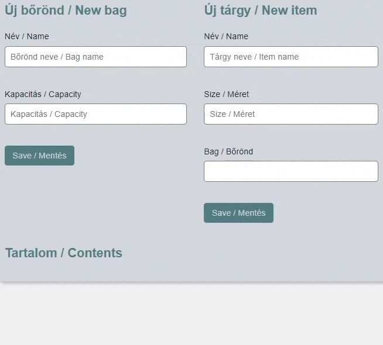

Egy nyaraláshoz természetesen be is kell pakolni a bőröndöket, mielőtt útra kelnénk. A valóság azonban azt mutatja, hogy soha nincs elég hely. Ebben a feladatban bőröndpakolást elősegítő alkalmazást kell készítened, amelyben bőröndöket lehet létrehozni azok kapacitásának megadásával, majd azokba tárgyakat helyezni, ameddig elférnek. Ebben a feladatban az űrlapokon küldött adatokat nem kell ellenőrizni. Az adatokat JSON fájl(ok)ban vagy SQLite adatbázisban kell tárolni!

- a. (2 pont) Az oldal tetején található bal oldali űrlap használatával legyen lehetőség egy új bőröndöt létrehozni annak nevének és kapacitásának megadásával!
- b. (2 pont) Az oldal tetején található jobb oldali űrlapban töltsd fel a legördülő menüt a létrehozott bőröndök neveivel!
- c. (2 pont) A jobb oldali űrlap elküldésekor mentsd el, hogy milyen nevű tárgyat melyik bőröndbe pakoltunk be és mennyi helyet foglal!
- d. (2 pont) Jelenítsd meg a bőröndök nevét és a bennük lévő tárgyakat a mintán látható módon, kétszintű listaként!
- e. (2 pont) Minden tárgy mellett legyen egy ,,Kivesz'' feliratú link, amelyre kattintva a tárgy eltávolítható a bőröndből!
- f. (2 pont) Számítsd ki, hogy összesen mennyi helyet foglalnak az egyes bőröndökben lévő tárgyak, majd a bőröndök neve mellett jelenítsd meg a foglalt és a teljes kapacitásukat!
- g. (2 pont) Oldd meg, hogy egy bőröndbe egy tárgyat csak akkor lehessen belepakolni, ha van még a bőröndben a tárgy méretének megfelelő szabad hely! Ha ez nem teljesül, adj hibaüzenetet! _(Segítség: több PHP fájl között a hibajelzés megvalósítható például munkamenet használatával.)_

