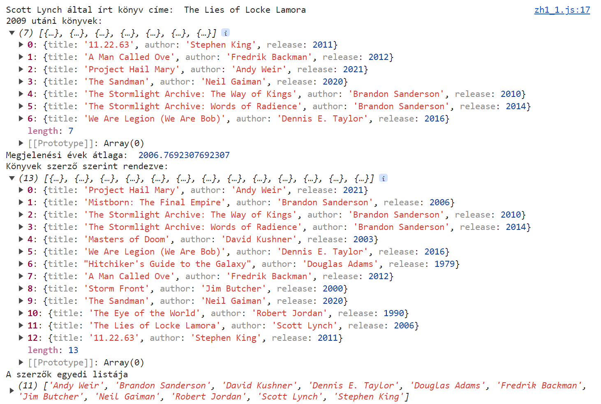
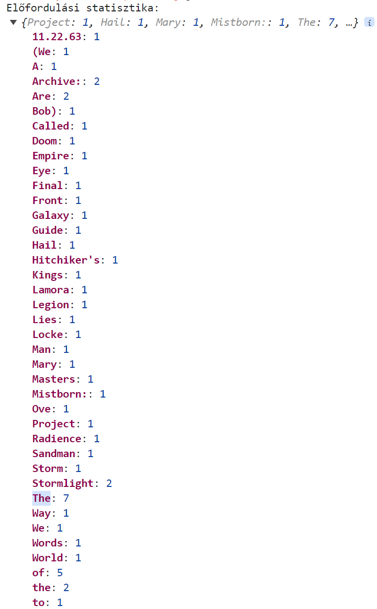
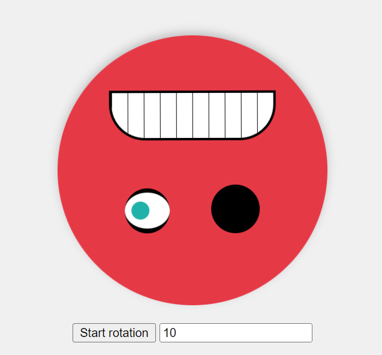

# Webprogramozás 2024-2025-1 JavaScript ZH

Az eredményeket küldjétek a `babuafi@inf.elte.hu` e-mail címre.

## 1. feladat

A fájlok között találsz egy `books.js` nevű fájlt, ebben könyvek listáját találod egy `books` nevű változóban.
Ez a változó már be van importálva a `zh1_1.html` fájlba, egyből tudod is használni a `zh1_1.js`-ben.

A könyvekről a következő adatokat tároljuk:
- title: A könyv címe.
- author: A könyv szerzője.
- release: A könyv megjelenésének éve.

Az alábbi alfeladatok eredményét írasd ki a console-ra.
A `console.log` parancs és a változók már adottak, csak töltsd ki őket a megfelelő értékekkel.

1.1 **Keresd meg azt a könyvet amelyet "Scott Lynch" írt és írasd ki a könyv címét (a többi adatát ne!).** (1 pont)

1.2 **Listázd ki azokat a könyveket amelyek 2009 után jelentek meg.** (1 pont)

1.3 **Számold ki a megjelenési évek átlagát.** (1 pont)

    Segítség:

    Átlagszámítás emlékeztető:
    Egy számokat tartalmazó tömb átlagát úgy tudod kiszámolni, ha összeadod az összes számot, majd elosztod a tömb
    méretével (másképp megfogalmazva HOSSZával).

    Példa:
    [1, 1, 2, 4, 5]
    átlaga:
    (1 + 1 + 2 + 4 + 5) / 5 = 2.6

1.4 **Rendezd ABC rendbe a könyvek listáját a szerző neve alapján.** (1 pont)

Olyan összehasonlítási módot használj, amely működne ékezetes karakterek esetén is!

1.5 **Készíts egy egyedi listát a szerzőkről.
Tehát ha egy szerzőtől több könyv is szerepel a listában akkor is csak egyszer jelenjen meg az eredményben.** (1 pont)

+1 **Készíts egy statisztikát a könyvek címében szereplő szavakról.** (1 pont)

A szavak előfordulásának gyakoriságát írasd ki console-ra.

A kis/nagy betűk közti különbséggel nem szükséges foglalkozni, jó akkor is ha külön számolja például a "the" és "The"
szavakat, de az is ha egybe.

## 2. Feladat

A HTML-ben találhatsz egy smileyt, az alábbi feladatokban ezt kell manipulálni.

A szükséges stílusosztályok már létre lettek hozva a `zh1_2.css` fájlban, így ott plusz dolgod nincs.

2.1 **A smiley kezdjen el forogni amikor az alatta található "Forgás-kapcsoló" gombra kattintunk.** (1.5 pont)

A smiley akkor kezd el forogni ha a `smileyEl` elemre hozzáadod a `rotating` osztályt.

A gomb legyen kétállapotú, tehát ha újra rákattintunk álljon meg a forgás.
Ezt azonban ne a `rotating` osztály eltávolításával old meg, hanem rakj rá egy újabb osztályt: `paused`.
A következő újraindításoknál a `rotating` osztály újbóli hozzáadása helyett a `paused` osztályt távolítsd el.

2.2 **Ne tudjon kacsintani a smiley amikor éppen forog.** (1.5 pont)

A smiley szemei checkboxok, tehát kattinthatóak amivel a checkbox `checked` tulajdonsága változik.

Ez az **alap működés** ne történjen meg ha forog a smiley
(a `rotating` és a `paused` osztályt is vedd figyelembe)!

Amikor ezt a működést blokkolod dobj fel egy üzenetet (alert) is a következő szöveggel:
"Még a szemeim sem merem megmozdítani!"

2.3 **A smiley bőrére kattintva változzon annak színe a `colors` tömb alapján.** (1 pont)

A `colors` tömbben találod a használható színeket.
Nézd meg jelenleg milyen színt vesz fel a `smileyEl` háttere, keresd meg ennek indexét a `colors` tömbben majd válaszd
a következő színt.

Fontos, hogy az utolsó szín kiválasztása esetén kezdődjenek előlről a színek!

A kezdeti szín a tömb utolsó eleme alapból.

2.4 **Amikor a smiley szájára kattintunk ne történjen meg a `2.3`-ban implementált színezés.** (1 pont)

A szemekkel nem szükséges pluszban foglalkozni, ha a checkboxokra kattintva változik a háttér az nem gond!

+1 **Generálj beírt számú fogat a "Maradék fogak száma" input változásakor.** (1 pont)

Ehhez csak annyit kell tenned, hogy a `frownEl` elembe beszúrod a `

` HTML-t annyiszor
amekkora számot megadott a felhasználó.

Nem szükséges validálni az input értékét.

    Segítség:
    A legegyszerűbb megoldás egy tömb függvénnyel létrehozni az egész HTML-t, azonban ha for ciklust használnátok
    fontos tudni, hogy a HTML elemek tartalma nem csak felülírható hanem bővíthető is, ha a végére írjátok a új
    tartalmat.
    
    Segítség:
    A tömbök `join` függvénye használható arra, hogy egy sztringeket tartalmazó tömböt összefűzd egyetlen sztringgé.

    Segítség:
    Létre tudtok hozni tetszőleges elemszámú tömböt, 10 elem esetén így nézne ki:
    [...new Array(10)]

