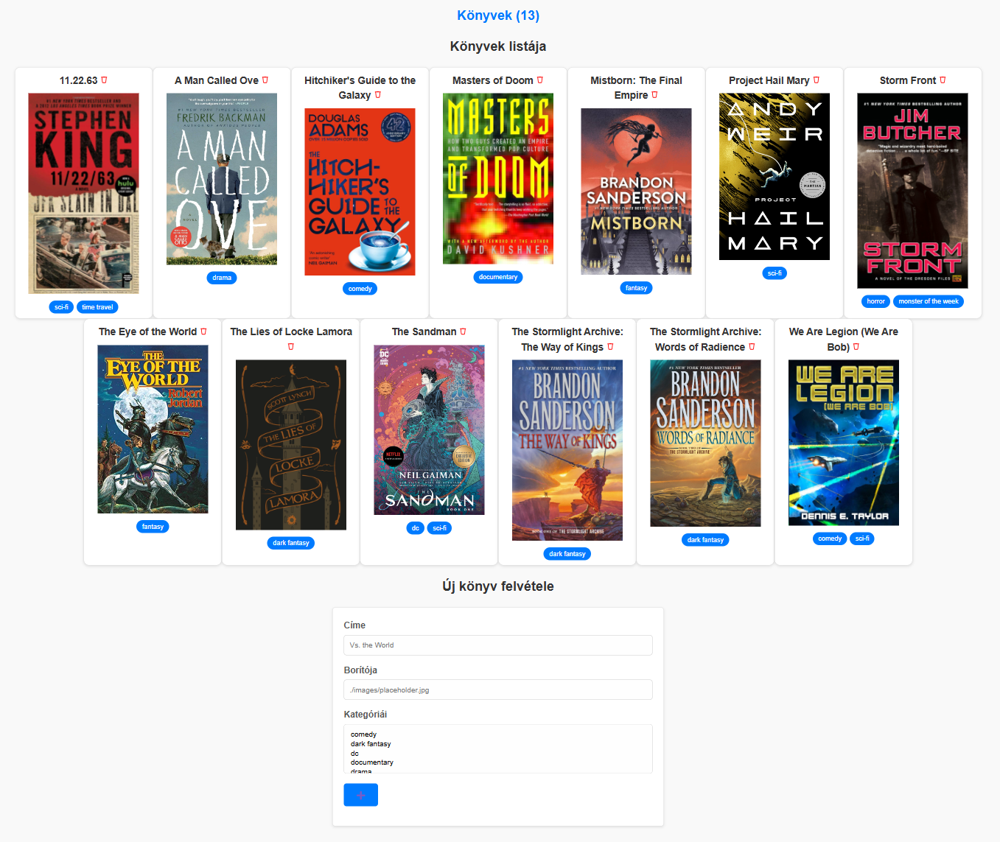

# Webprogramozás 2024-2025-1 PHP ZH

A `TASKS.MD` fájlban jelöljétek be, hogy mely feladatokat végeztétek el!

Az eredményeket Canvas-ra töltsétek fel a "PHP csoport ZH" feladathoz.

## A feladat

A fájlok között találsz egy `books.json` nevű fájlt, ebben könyvek listáját találod.

A könyvekről a következő adatokat tároljuk:
- id: A könyv azonosítója.
- title: A könyv címe.
- cover: A könyv borítóképe.
- categorise: A könyv kategóriái.

A `zh2.php` fájlban találsz egy űrlapot, ezt lehet használni új könyvek felvételére. 

1. **A felhasználó "$book_categories" változóban található kategóriákból tudjon választani új könyv felvételekor.** (1 pont)

Ehhez a `categories` azonosítójú "select" elembe generáld be a lehetőségeket.

2. **Olvasd be az összes könyvet és a "book_count" azonosítójú elembe írasd ki a könyvek számát.** (1 pont)

A beolvasáshoz célszerű a Storage.php-ben található segédosztályokat használni.

3. **Listázd ki a könyveket a "book_list" azonosítójú elembe.** (1.5 pont)

Kikommentezve találhatsz egy példát arra, hogy egy könyvhöz milyen struktúrájú HTML-nek kell tartoznia.
Jelenjen meg a könyv címe, a borítóképe és az összes kategóriája is.

4. **Az űrlap használatával lehessen új könyvet regisztrálni.** (1.5 pont)

Regisztrációval a könyv kerüljön be a "books.json" fájlba.

Segítség: A következő feladatok miatt érdemes a hozzáadás lekezelését a "zh2.php" fájlban végezni.

5. **Validáld szerveroldalon (PHP-ben) a könyvek borítójánál beadott sztringet.** (1.5 pont)

Két elfogadható lehetőség legyen:

- A megadott sztring "./images/"-el kezdődik és ".jpg"-re vagy ".webp"-re végződik.

VAGY

- A sztring egy valid URL.

Hiba esetén egy hibaüzenet jelenjen is meg a borítóképhez tartozó input alatt.

Segítség: Az első feltételhez használhatóak a PHP "str_starts_with" és "str_ends_with" függvényei, a másodikhoz
pedig érdemes a "filter_var"-t használni.

6. **Legyen állapottartó az űrlap, azaz a megadott inputok legyenek kitöltve
a korábban megadott értékekkel form submit után is.** (2 pont)

Fontos, hogy mindhárom mező legyen állapottartó:
- Cím
- Borítókép
- Kategóriák

Segítség: A kategóriáknál az ellenőrzés valamivel bonyolultabb, mert 3 dolgot is nézned kell:
- Érkezett-e adat hozzáadáshoz ($_POST-ban van-e valami).
- Küldött-e be kategóriákat a felhasználó (előfordulhat, hogy nem választott egyet sem, erre az esetre is működjön!).
- Ha küldött be kategóriákat akkor szerepel-e az aktuális kategória a beküldöttek listájában.

7. **Legyen lehetőség könyvek törlésére.** (1.5 pont)

A törlés gomb a könyvek neve mellett található.

A törlést egy külön PHP fájlban (`delete.php`) implementáld.

A frissített lista egyből legyen látható a felhasználó számára, tehát navigáld vissza a felhasználót a `zh2.php` oldalra.

+1 **Bármelyik kategóriára kattintva legyen leszűrve a lista csak arra a kategóriára.** (1 pont)

Segítség: Egy query paraméterrel ez könnyedén megoldható.
A filterezés visszavonását nem szükséges implementálni.

